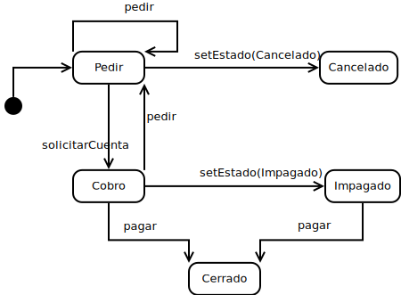

## Design Principles
## Single responsibility
I follow the single responsibility principle on several occasions, for example for payment methods, where your only responsibility is to create the corresponding simplified invoice, or in the Pantry class, where your only responsibility is to store and manage the stock of products.
## Open-Closed
I follow this principle in the Pantry class, to decrement the stock of a product, this function is delegated to the product, this being different if it is a single or multiple product or a new type of product. I also follow this in the Command class, where I delegate all the methods to the State class. 
## Liskov substitution 
I follow this principle for the use of payment methods, where you can pay in multiple ways by changing the class that implements PaymentMethod.
## Dependency inversion 
I follow dependency inversion for payment methods, order states and products.
For example, when making the list of products in the Pantry class, Products are stored, and not a specific type of them.
## Encapsulate what varies
I follow this principle for order states and payment methods, as these are the parts most likely to vary in the future, by adding new payment methods or order states. 

## Design Patterns

## Composition Pattern
I used this pattern to represent the **Product** types.
Since products can be single or multiple and multiples contain a list of products, the composition pattern is perfect.
### Class diagram

### Dynamic sequence diagram 

## State Pattern
I used this pattern to represent the different phases of the **Command**.
I treat the different phases of a command as *States* in which it can be found, deriving the methods to the **State** interface that will act differently depending on its implementation (if it is in the phase of charging, ordering, etc.).
### Class diagram

### Dynamic state diagram 

## Strategy pattern
I used this pattern for the different types of **PaymentMethod**.
To follow the principle of encapsulating what varies and single responsibility, I separate the payment method into an interface that allows you to vary the method or create new payment methods without modifying the code of all the *states* that implement it.
### Class diagram

### Dynamic sequence diagram 

Translated with DeepL.com (free version)